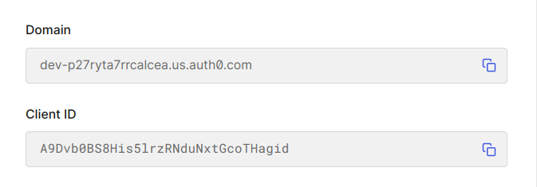

# @amplication/plugin-auth-auth0

[](https://www.npmjs.com/package/@amplication/plugin-auth-auth0)

This plugin helps in integrating [Auth0](https://auth0.com/) into your app generated by Amplication and provides the required configuration files.

<details open="open">
  <summary>Table of Contents</summary>
  <ol>
    <li><a href="#purpose">Purpose</a></li>
    <li><a href="#working-with-the-plugin">Working with the plugin</a>
      <ul>
        <li><a href="#using-management-api">Using Management API</a></li>
        <li><a href="#manually">Manually</a></li>
      </ul>
    </li>
    <li>
      <a href="#elaboration">Elaboration</a>
      <ul>
        <li><a href="#get-management-api-token">Get Management API Token</a></li>
        <li><a href="#create-an-auth0-application">Create an Auth0 application</a></li>
        <li><a href="#create-an-auth0-api">Create an Auth0 API</a></li>
        <li><a href="#create-an-auth0-action">Create an Auth0 action</a></li>
    </li>
    <li><a href="#usage">Usage</a></li>
  </ol>
</details>

## Purpose

Provides a way to integrate Auth0 into your app generated by Amplication by adding the required dependencies and configuration files. [**Auth0**](https://auth0.com/) is an authentication and authorization platform that provides the required tools to secure your applications and services.

## Working with the plugin

It can be used by adding the plugin in the `plugins` page of the app settings. The plugin can be added by providing the settings as shown in the method you want to use as well as the [general settings](#general-configuration).

> **Note:** Have to add the [auth-core-plugin](../auth-auth0/README.md) plugin before adding this plugin.

Results in configuring the app to use auth0 for authentication. It adds the necessary dependencies, creates a JWT strategy and adds the required environment variables in the `.env` file.

## General Configuration

The following values are required to be provided in the plugin settings.

- `recipe`: The type of Authenticated recipe to use.

  - `type`: `password` or `passwordless` ( Optional, Default: `password` )
  - `method`: `email` or `sms` or `magic-link` ( Optional, Default: `email` )
  - `emailFieldName`: The name of the field to use for finding the user by email. If not provided, email field from payloadMapping will be used or a field of type `Email` will be used from your auth entity. ( Optional )
  - `payLoadMapping`: The mapping of the fields to use for payload. This has to be given in the format of `key: value` where the key is the name of the field in the auth entity and the value is the name of the field in the payload. Currently supported fields from payload are `email`, `email_verified`, `name`, `nickname`, `picture`, `username`. ( Optional )

- `defaultUser`: The default user to be created in the database. This has to be given in the format of `key: value` where the key is the name of the field in the auth entity and the value is the value of the field to be set for the default user. If a field is not provided, it will be set to default value according to the type of the field. For more information, see [Default Values](src/utils/createAuthProperties.ts#L53-L142)

**Example**

```json
{
  "settings": {
    "recipe": {
      "type": "password",
      "emailFieldName": "email",
      "payloadFieldMapping": {
        "username": "name",
        "name": "name"
      }
    },
    "defaultUser": {
      "username": "Ashish Padhy",
      "roles": ["admin"],
      "name": "Ashish Padhy",
      "bio": "",
      "email": "example@gmail.com",
      "age": 0,
      "birthDate": "2021-06-01T00:00:00.000Z",
      "score": 0,
      "interests": [],
      "priority": "high",
      "isCurious": false,
      "location": "(32.085300, 34.781769)",
      "extendedProperties": {
        "foo": "bar"
      }
    }
    // Method specific settings ( See Method Specific Configuration )
  }
}
```

### Using Management API

This method uses the [Auth0 Management API](https://auth0.com/docs/api/management/v2) to get the required values.

> **Note:** This method requires the user to have an auth0 account or have access to JWT token of the auth0 account.

#### Method Specific Configuration

This method requires the following values to be provided in the plugin settings.

- `useManagementApi` : `true` ( To use this method )
- `managementParams` :
  - `identifier` : The identifier of the Auth0 Management API ( See [get management api token](#get-management-api-token) )
  - `accessToken` : The access token of the Auth0 Management API ( See [get management api token](#get-management-api-token) )
  - `actionName` : The name of the action which you want to create in the Auth0 account. ( Optional, Default: `Add user details to access token` )
  - `clientName` : The name of the client which you want to create in the Auth0 account. ( Optional, Default: `Amplication SPA` )
  - `apiName` : The name of the API which you want to create in the Auth0 account. ( Optional, Default: `Amplication API` )
  - `audience`: The audience/identifier of the API which you want to create in the Auth0 account. ( Optional, Default: `http://localhost:3001` )

**Example**

```json
{
  "settings": {
    "useManagementApi": true,
    "managementParams": {
      "identifier": "https://{TENANT_NAME}.{REGION}.auth0.com/api/v2/",
      "accessToken": "{ACCESS_TOKEN}",
      "actionName": "Add user details to access token",
      "clientName": "Custom SPA",
      "apiName": "Custom API",
      "audience": "http://example.com"
    }
    // General settings ( See General Configuration )
  }
}
```

### Manually

This method requires the user to manually create the required values in the Auth0 account and provide the values in the plugin settings.

#### Method Specific Configuration

This method requires the following values to be provided in the plugin settings.

- `useManagementApi` : `false` ( To use this method )
- `domain` : The domain of the Auth0 application (client) ( See [copy domain](#L179) )
- `clientID` : The client id of the Auth0 application (client) ( See [copy client id](#L180) )
- `audience` : The audience/identifier of the API which you have created in the Auth0 account. ( See [copy audience](#L188) )
- `issuerURL` : The issuer base url of the API which you have created in the Auth0 account. ( See [copy issuer base url](#L189) )

**Example**

```json
{
  "settings": {
    "useManagementApi": false,
    "domain": "dev-p27ryta7rrcalcea.us.auth0.com",
    "clientID": "A9Dvb0BS8His5lrzRNduNxtGcoTHagid",
    "audience": "https://sample-nest.demo.com",
    "issuerURL": "https://dev-p27ryta7rrcalcea.us.auth0.com/"
    // General settings ( See General Configuration )
  }
}
```

## Elaboration

This section elaborates on the steps to be followed to get the required values for the plugin settings. Prerequisite for this is to have an Auth0 account.

### Get Management API Token

- Go to [Management Explorer](https://manage.auth0.com/#/apis/management/explorer) and copy the token as shown there.
  If there is no token, click on the `Create Testing Application` button and create a testing application. Then copy the token. This is the value of the `accessToken` field in the plugin settings.

- Go to [Management Settings Page](https://manage.auth0.com/#/apis/management/settings) and copy the value of the `Identifier` field. This is the value of the `identifier` field in the plugin settings.

### Create an Auth0 application

- Go to [Applications Page](https://manage.auth0.com/#/applications) and create a new application of type `Single Page Web Applications`.
- Select React in the Quickstart tab or follow the steps below.
- Change the following values to their keys :-

  - Allowed Callback URLs : http://localhost:3001/auth-callback
  - Allowed Logout URLs : http://localhost:3001/login
  - Allowed Web Origins : http://localhost:3001

- Go to the settings tab and copy the values of the following :-

  - Domain
  - Client ID

  

### Create an Auth0 API

- Go to the [API Dashboard](https://manage.auth0.com/#/apis) and create a new API with the following values :-

  - Identifier : https://sample-nest.demo.com
  - Signing Algorithm : RS256

- Go to the quickstart tab and switch to NodeJS tab and copy the values of the following :-

  - Audience
  - IssuerBaseURL

  **Sample Auth0 API Settings**

  ```js
  const jwtCheck = auth({
    audience: "http://localhost:3001",
    issuerBaseURL: "https://dev-z4opqj3d1oykaaaw.us.auth0.com/",
    tokenSigningAlg: "RS256",
  });
  ```

### Create an Auth0 action

- Go to the [Actions Library](https://manage.auth0.com/#/actions/library) and click on the **Build Custom** button.
- Set the following values :-

  - Name : Add user details to access token ( Or any name you want )
  - Trigger : Login / Post Login
  - Runtime : Node18 ( Or any runtime you want )

- Click Create Button.
- In the code editor, set the following code :-

  ```js
  exports.onExecutePostLogin = async (event, api) => {
    if (event.authorization) {
      // Set claims
      api.accessToken.setCustomClaim("user", event.user);
    }
  };
  ```

- Save and click on the **Deploy** button.
- Go to the [Actions Flows](https://manage.auth0.com/#/actions/flows/login) and the action you have created between **Start** and **Complete** nodes. For more information, see [Auth0 Actions](https://auth0.com/docs/customize/actions/write-your-first-action#attach-the-action-to-a-flow).
