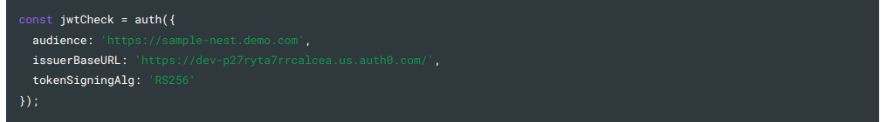
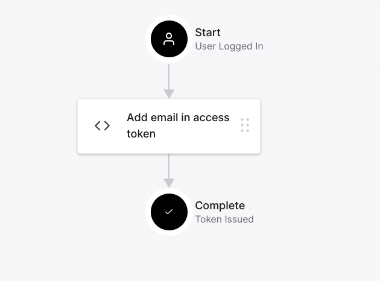

# @amplication/plugin-auth-auth0

[](https://www.npmjs.com/package/@amplication/plugin-auth-auth0)

This plugin helps in integrating [Auth0](https://auth0.com/) into your app generated by Amplication and provides the required configuration files.

## Purpose

Provides a way to integrate Auth0 into your app generated by Amplication by adding the required dependencies and configuration files. [**Auth0**](https://auth0.com/) is an authentication and authorization platform that provides the required tools to secure your applications and services.

## Prerequisites

- [Auth0](https://auth0.com/) account
- [Create an Auth0 application](#create-an-auth0-application) ( Single Page Application )
- [Create an Auth0 API](#create-an-auth0-api) ( Machine to Machine )
- [Create an Auth0 action](#create-an-auth0-action) ( Post Login ) to add the user's name, email in access token

## Elaboration

### Create an Auth0 application

- Go to [Auth0](https://auth0.com/) and create an account.
- Create a new application of type Single Page Application ( Select the React Quickstart )
- Change the following values to their keys :-

  - Allowed Callback URLs : http://localhost:3001/auth-callback
  - Allowed Logout URLs : http://localhost:3001/login
  - Allowed Web Origins : http://localhost:3001

- Go to the settings tab and copy the values of the following :-

  - Domain
  - Client ID

  

### Create an Auth0 API

- Go to the dashboard and create a new API of type Machine to Machine
- Set the following values :-

  - Identifier : https://sample-nest.demo.com
  - Signing Algorithm : RS256

- Go to the quickstart tab and switch to NodeJS tab and copy the values of the following :-

  - Audience
  - IssuerBaseURL

  

### Create an Auth0 action

- Go to the dashboard and create a new action of type Post Login through Flows tab ----> Login -----> Create Action
- Set the following values :-

  - Name : Add user details to access token
  - Code :-

    ```js
    exports.onExecutePostLogin = async (event, api) => {
      if (event.authorization) {
        // Set claims
        api.accessToken.setCustomClaim("user", event.user);
      }
    };
    ```

- Save and deploy the action
- Put the action in the Login flow by going to Flows tab ----> Login -----> Select the action from the dropdown and put it between Login and Token issued.
  

## Configuration

This plugin requires the following settings during plugin configuration:

- `domain` - See [copy domain](./#L32)
- `clientId` - See [copy client id](#L33)

- `audience` - See [copy audience](#L47)
- `issuerURL` - See [copy issuer base url](#L48)

## Example :-

```json
{
  "settings": {
    "domain": "dev-p27ryta7rrcalcea.us.auth0.com",
    "clientId": "A9Dvb0BS8His5lrzRNduNxtGcoTHagid",
    "audience": "https://sample-nest.demo.com",
    "issuerURL": "https://dev-p27ryta7rrcalcea.us.auth0.com/"
  }
}
```

## Working with the plugin

It can be used by adding the plugin in the `plugins` page of the app settings. The plugin can be added by providing the settings as shown in the [Configuration](#configuration) section.

> **Note:** Have to add the [auth-core-plugin](../auth-auth0/README.md) plugin before adding this plugin.

Results in configuring the app to use auth0 for authentication. It adds the necessary dependencies, creates a JWT strategy and adds the required environment variables in the `.env` file.

## Usage

Before using the app, make sure to have done the following :-

### Create an admin user in the postgres database

- Go to CustomSeed and add user details as follows ( or as per your own authEntity ) :-

  ```js
  const user = {
    name: "YOUR_NAME",
    email: "YOUR_EMAIL",
    roles: ["admin"],
    username: "YOUR_USERNAME"
    age: 0,
    birthDate: new Date(),
    score: 0,
    interests: [],
    priority: "low",
    isCurious: false,
    location: "(32.085300, 34.781769)",
    bio: "YOUR BIO",
    extendedProperties: {},
  };
  ```

- Then run the following command to seed the database :-

  ```sh
  $ npm run seed
  ```

- The user can now login with the email in Auth0.
