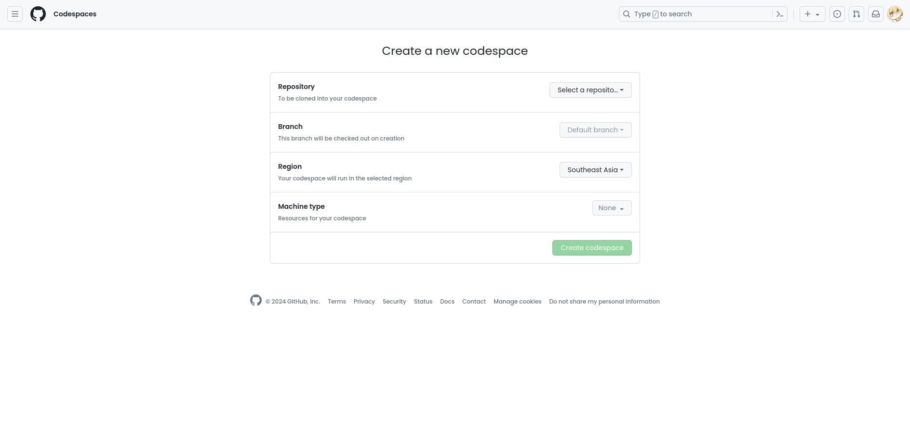

# @amplication/plugin-devcontainer-github-codespaces

Quickly generates the configuration that you require to setup devcontainer for your Amplication App

## Purpose
This plugin serves the purpose of generating devcontainer based on your configuration for your Amplication app

## Usage

1. To install the plugin:
   - Enable the plugin in the Amplication dashboard
   - Configure the plugin according to your needs
   - Commit changes and build!

2. To use the plugin
   - Head over to https://github.com/codespaces/new to create a new codespace
     
     

   - In repository, select the repository that you pushed your Amplication code to.
     In branch, select the branch that your pushed your Amplication code to.
     In Dev container configuration, choose the configuration with the name of your Amplication app.
     In region, select the region that is nearest to you.
     In machine type, select the specs for the codespace that you want to use

     

   - Lastly, click on the Create Codespace to create your codespace and start developing!

## Configuration

This plugins allows you to customize the devcontainer config based:

- includeAdminUI (boolean): Start Admin UI alongside the server
- customLocation (string | null): Allows generating config as a specific directory.
- generateBasedOnServiceName (string): Generates the config based on the service name, i.e., at `<root>/.devcontainer/<service-name>/devcontainer.json`

>[!WARNING]
>If `customLocation` is not null and the `generateBasedOnServiceName` is true, then the latter will be ignored and the config will be generated in the custom location provided

## Scripts

### `build`

Running `npm run build` will bundle your plugin with Webpack for production.

### `dev`

Running `npm run dev` will watch your plugin's source code and automatically bundle it with every change.